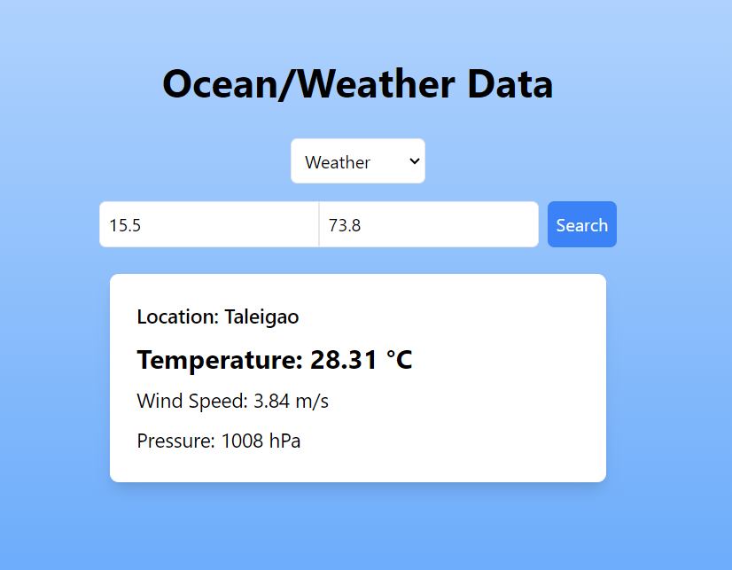

# 🌊 Ocean/Weather Data App 🌤️

Welcome to the Ocean/Weather Data App! This Next.js application allows you to fetch and display weather or ocean data based on latitude and longitude inputs. 🌍

## 🚀 Features

- Fetch current **weather** data (temperature, wind speed, pressure).
- Retrieve **ocean** data (sea surface temperature, salinity, chlorophyll-a, current speed, wave height).
- Easy-to-use interface with a responsive design. 📱
- Select between weather and ocean data with a dropdown menu.

## 🛠️ Technologies Used

- **Next.js** - React framework for building server-rendered applications.
- **Tailwind CSS** - Utility-first CSS framework for styling.
- **OpenWeatherMap API** - For fetching weather and ocean data.
- **Axios** - Promise-based HTTP client for making API requests.

## 🏗️ Getting Started

### Prerequisites

- Node.js (v14 or higher)
- npm or yarn
- An OpenWeatherMap API key. 🗝️

### Installation

1. Clone the repository:

   ```bash
   git clone https://github.com/yourusername/ocean-weather-data-app.git
   cd ocean-weather-data-app
   ```

2. Install dependencies:

   ```bash
   npm install
   # or
   yarn install
   ```

3. Create a `.env.local` file in the root of your project and add your OpenWeatherMap API key:

   ```bash
   NEXT_PUBLIC_WEATHER_API_KEY=your_api_key_here
   ```

4. Start the development server:

   ```bash
   npm run dev
   # or
   yarn dev
   ```

5. Open your browser and navigate to [http://localhost:3000](http://localhost:3000) to view the app! 🎉

## 📸 Screenshots



## 📝 Usage

1. Select the type of data you want to fetch (Weather or Ocean Data).
2. Enter the latitude and longitude in the provided input fields.
3. Click on the **Search** button to fetch the data. 🔍

## 📄 License

This project is licensed under the MIT License - see the [LICENSE](LICENSE) file for details.

## 🙌 Contributing

Contributions are welcome! If you have suggestions or improvements, feel free to open an issue or submit a pull request. 🛠️

---

Enjoy exploring ocean and weather data! 🌊🌤️
